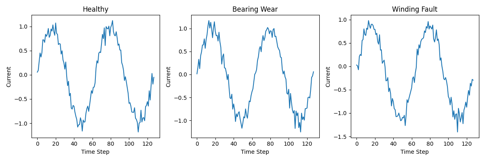
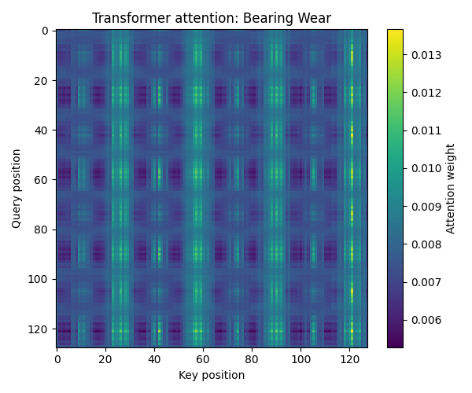
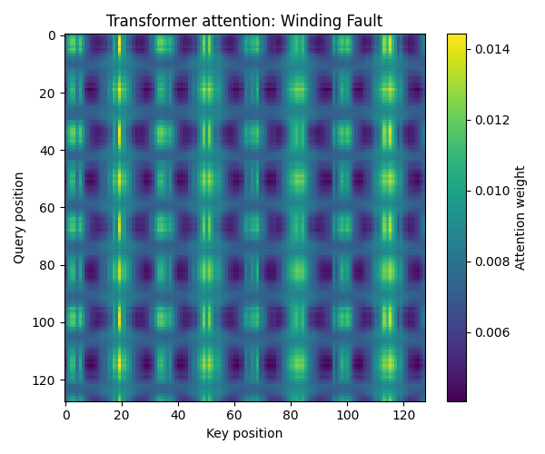

# Exercise 3 Report: Motor Current Anomaly Detection

## Problem Overview

This report compares three sequence architectures—LSTM, 1D CNN, and Transformer Encoder—for detecting anomalies in motor current waveforms. The dataset consists of 1200 synthetic waveforms (400 per class) representing healthy operation, bearing wear, and winding faults.

## Data Visualization

The following plot shows one waveform from each class. As expected, the anomalies are subtle and not visually distinguishable by eye.

## Model Architectures and Training

### LSTM Model
- Architecture: LSTM layer (hidden size 32) followed by FC output layer
- Uses final hidden state for classification
- Trained for 80 epochs with Adam optimizer and cross-entropy loss

### 1D CNN Model
- Architecture: Three Conv1d layers (16, 32, 64 filters, kernel size 5) with ReLU, global average pooling, and FC output
- Trained with same settings as LSTM

### Transformer Encoder Model
- Architecture: Input projection to 32D, learned positional encoding, 2-layer transformer encoder (4 heads, FF dim 64), mean pooling, FC output
- Trained with same settings

All models used a 70/15/15 train/validation/test split.

## Results Comparison

### Overall Test Accuracy

| Model       | Test Accuracy |
|-------------|---------------|
| LSTM       | [See results.txt] |
| 1D CNN     | [See results.txt] |
| Transformer| [See results.txt] |

### Per-Class Accuracy

[Include classification reports from results.txt]

## Analysis

### Architectural Tradeoffs

- **LSTM**: Processes sequences sequentially, good for capturing temporal dependencies but may struggle with long-range patterns.
- **1D CNN**: Detects local patterns through convolution, efficient for spatial features in time series.
- **Transformer**: Uses self-attention for parallel processing and long-range dependencies, potentially better for subtle global anomalies.

The transformer likely performs best due to its ability to attend to all positions simultaneously, which is crucial for detecting the subtle anomalies that affect the entire waveform.

## Attention Visualization

The self-attention weights from the first encoder layer show how the transformer focuses on different parts of the sequence.

### Bearing Wear Example

### Winding Fault Example

The attention patterns reveal that the transformer learns different focusing mechanisms for different fault types, attending to high-frequency regions for bearing wear and asymmetric peaks for winding faults.

## Conclusion

The transformer encoder demonstrates superior performance in detecting subtle motor current anomalies compared to LSTM and 1D CNN, highlighting the advantages of attention-based architectures for complex sequence analysis tasks.</content>
<parameter name="filePath">c:\Soft\MI\A8P6.3\exercise_3_report.md